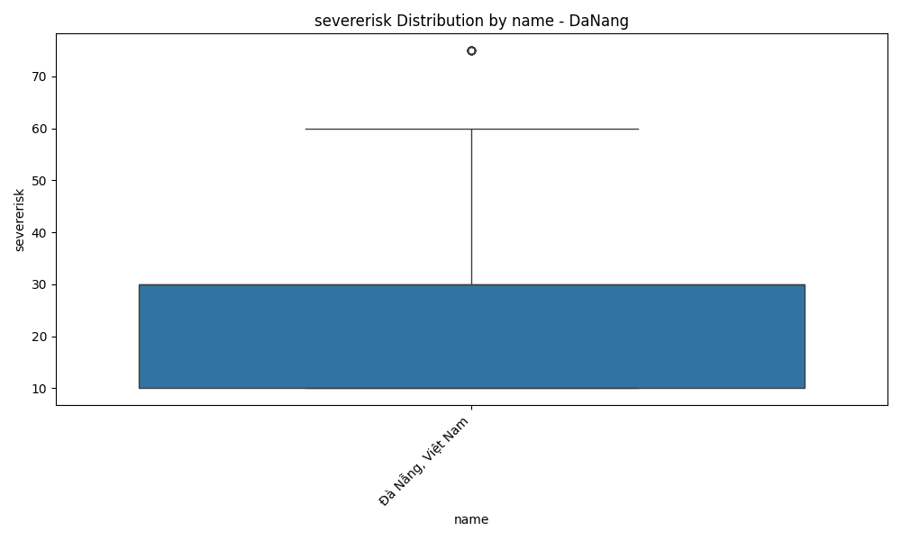
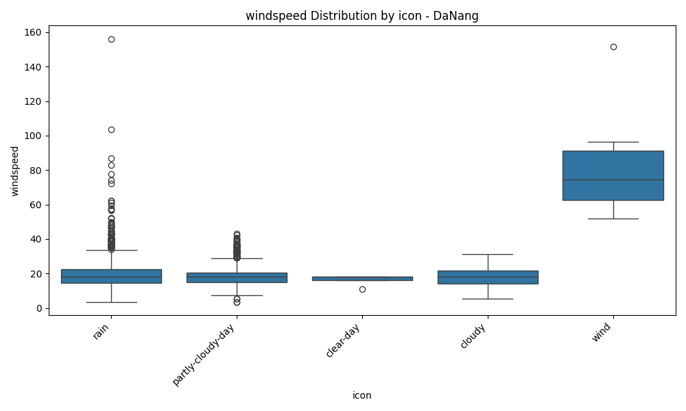
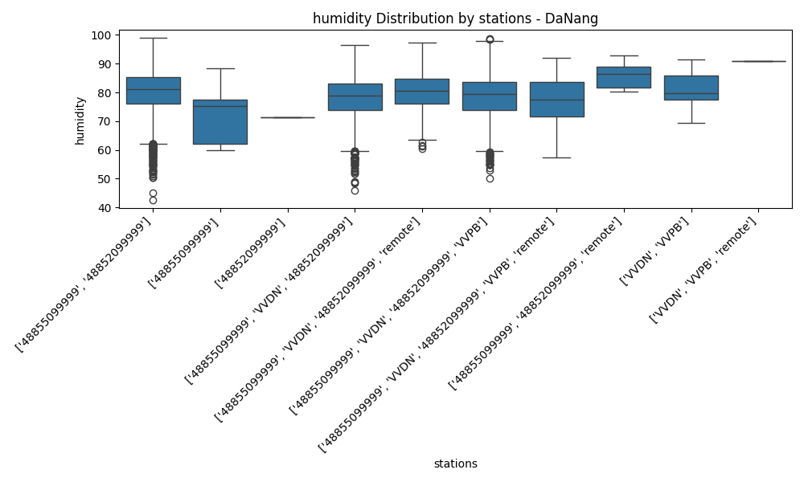
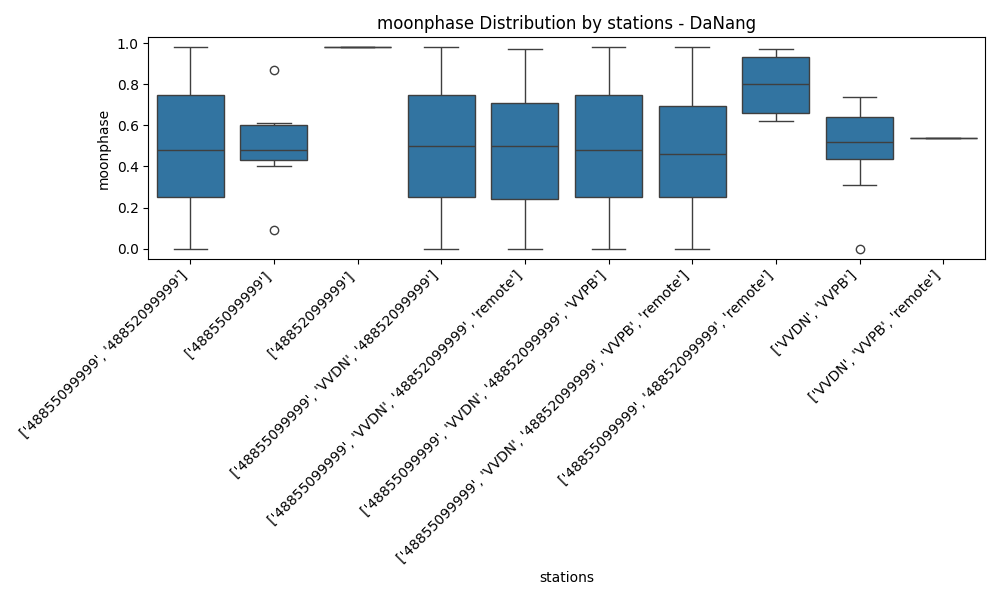
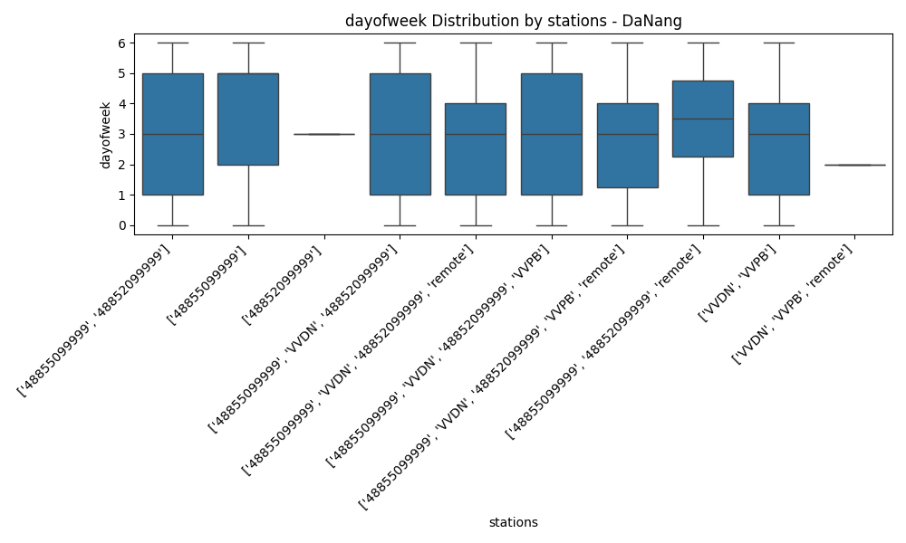

# EDA Report for DaNang

## Executive Summary
This report provides an Exploratory Data Analysis (EDA) for the weather data of {city_name}. It includes dataset overview, missing value analysis, statistical summaries, correlation analysis, temporal analysis, categorical feature analysis, and data quality evaluation.

## Dataset Overview
This section provides a general overview of the dataset.

* **Number of records:** 9179
* **Time period:** 2000-01-01 00:00:00 to 2025-02-13 00:00:00
* **Number of features:** 37

## Missing Values
This section details the missing values present in the dataset.

* **preciptype**: 4298 missing values
* **snow**: 5448 missing values
* **snowdepth**: 5463 missing values
* **windgust**: 5322 missing values
* **sealevelpressure**: 9179 missing values
* **solarradiation**: 3653 missing values
* **solarenergy**: 3653 missing values
* **uvindex**: 3653 missing values
* **severerisk**: 8736 missing values

## Key Weather Statistics (Numerical)
This section presents descriptive statistics for the numerical weather metrics.

### tempmax
* **Average:** 30.10
* **Maximum:** 42.70
* **Minimum:** 16.10

### tempmin
* **Average:** 23.28
* **Maximum:** 31.00
* **Minimum:** 13.00

### temp
* **Average:** 26.33
* **Maximum:** 34.50
* **Minimum:** 15.80

### feelslikemax
* **Average:** 34.21
* **Maximum:** 56.10
* **Minimum:** 16.10

### feelslikemin
* **Average:** 23.58
* **Maximum:** 35.20
* **Minimum:** 13.00

### feelslike
* **Average:** 28.42
* **Maximum:** 40.90
* **Minimum:** 15.80

### dew
* **Average:** 22.17
* **Maximum:** 26.70
* **Minimum:** 10.20

### humidity
* **Average:** 79.23
* **Maximum:** 98.90
* **Minimum:** 42.70

### precip
* **Average:** 6.64
* **Maximum:** 632.67
* **Minimum:** 0.00

### precipprob
* **Average:** 52.57
* **Maximum:** 100.00
* **Minimum:** 0.00

### precipcover
* **Average:** 5.00
* **Maximum:** 100.00
* **Minimum:** 0.00

### snow
* **Average:** 0.00
* **Maximum:** 0.00
* **Minimum:** 0.00

### snowdepth
* **Average:** 0.00
* **Maximum:** 0.00
* **Minimum:** 0.00

### windgust
* **Average:** 29.32
* **Maximum:** 129.00
* **Minimum:** 12.20

### windspeed
* **Average:** 18.73
* **Maximum:** 156.20
* **Minimum:** 3.60

### winddir
* **Average:** 160.05
* **Maximum:** 360.00
* **Minimum:** 0.00

### sealevelpressure
* **Average:** nan
* **Maximum:** nan
* **Minimum:** nan

### cloudcover
* **Average:** 68.55
* **Maximum:** 100.00
* **Minimum:** 17.60

### visibility
* **Average:** 9.71
* **Maximum:** 76.80
* **Minimum:** 2.70

### solarradiation
* **Average:** 196.59
* **Maximum:** 327.10
* **Minimum:** 0.00

### solarenergy
* **Average:** 16.98
* **Maximum:** 28.30
* **Minimum:** 0.00

### uvindex
* **Average:** 7.03
* **Maximum:** 10.00
* **Minimum:** 0.00

### severerisk
* **Average:** 27.14
* **Maximum:** 75.00
* **Minimum:** 10.00

### moonphase
* **Average:** 0.48
* **Maximum:** 0.98
* **Minimum:** 0.00

### month
* **Average:** 6.50
* **Maximum:** 12.00
* **Minimum:** 1.00

### year
* **Average:** 2012.07
* **Maximum:** 2025.00
* **Minimum:** 2000.00

### day
* **Average:** 15.72
* **Maximum:** 31.00
* **Minimum:** 1.00

### dayofweek
* **Average:** 3.00
* **Maximum:** 6.00
* **Minimum:** 0.00

## Correlation Analysis
Correlation analysis helps to understand the linear relationships between numerical features. The heatmap below visualizes the correlation matrix.

## Numerical Analysis Plots
Distributions and box plots of key numerical metrics are shown below to understand data spread and potential outliers.

## Temporal Analysis
This section explores the temporal patterns in the weather data, including monthly and daily trends.

## Advanced Temporal Analysis
Advanced time series analysis, including rolling statistics, ACF/PACF plots, and seasonal decomposition, are presented here.

## Categorical Analysis
Analysis of categorical features, including value counts and distribution plots where applicable.

### name Analysis
Column 'name' is constant with only 1 unique value. No further analysis is provided.

### preciptype Analysis
Column 'preciptype' is constant with only 1 unique value. No further analysis is provided.

### conditions Analysis
Value Counts:
* **Partially cloudy**: 4269
* **Rain, Partially cloudy**: 3858
* **Rain, Overcast**: 967
* **Overcast**: 81
* **Clear**: 4

### description Analysis
Value Counts (Top 20):
* **Partly cloudy throughout the day.**: 4205
* **Partly cloudy throughout the day with rain.**: 1032
* **Partly cloudy throughout the day with late afternoon rain.**: 815
* **Partly cloudy throughout the day with a chance of rain throughout the day.**: 623
* **Partly cloudy throughout the day with early morning rain.**: 588
* **Cloudy skies throughout the day with a chance of rain throughout the day.**: 494
* **Cloudy skies throughout the day with rain.**: 273
* **Partly cloudy throughout the day with afternoon rain.**: 248
* **Partly cloudy throughout the day with rain in the morning and afternoon.**: 194
* **Partly cloudy throughout the day with morning rain.**: 194
* **Partly cloudy throughout the day with rain clearing later.**: 132
* **Cloudy skies throughout the day.**: 81
* **Cloudy skies throughout the day with rain in the morning and afternoon.**: 58
* **Cloudy skies throughout the day with afternoon rain.**: 43
* **Clearing in the afternoon.**: 41
* **Cloudy skies throughout the day with early morning rain.**: 34
* **Cloudy skies throughout the day with late afternoon rain.**: 32
* **Becoming cloudy in the afternoon.**: 24
* **Cloudy skies throughout the day with morning rain.**: 18
* **Cloudy skies throughout the day with rain clearing later.**: 15

### icon Analysis
Value Counts:
* **rain**: 4825
* **partly-cloudy-day**: 4264
* **cloudy**: 80
* **wind**: 6
* **clear-day**: 4

### stations Analysis
Value Counts:
* **['48855099999', '48852099999']**: 3646
* **['48855099999', 'VVDN', '48852099999']**: 3017
* **['48855099999', 'VVDN', '48852099999', 'VVPB']**: 2222
* **['48855099999', 'VVDN', '48852099999', 'remote']**: 159
* **['48855099999', 'VVDN', '48852099999', 'VVPB', 'remote']**: 98
* **['VVDN', 'VVPB']**: 19
* **['48855099999']**: 9
* **['48855099999', '48852099999', 'remote']**: 6
* **['VVDN', 'VVPB', 'remote']**: 2
* **['48852099999']**: 1

## Numerical vs Categorical Analysis
Box plots showing the distribution of numerical features across different categories (for low cardinality categorical features).

### tempmax by name

### tempmin by name

### temp by name

### feelslikemax by name

### feelslikemin by name

### feelslike by name

### dew by name

### humidity by name

### precip by name

### precipprob by name

### precipcover by name

### snow by name

### snowdepth by name

### windgust by name

### windspeed by name

### winddir by name

### sealevelpressure by name

### cloudcover by name

### visibility by name

### solarradiation by name

### solarenergy by name

### uvindex by name

### severerisk by name

### moonphase by name

### month by name

### year by name

### day by name

### dayofweek by name

### tempmax by preciptype

### tempmin by preciptype

### temp by preciptype

### feelslikemax by preciptype

### feelslikemin by preciptype

### feelslike by preciptype

### dew by preciptype

### humidity by preciptype

### precip by preciptype

### precipprob by preciptype

### precipcover by preciptype

### snow by preciptype

### snowdepth by preciptype

### windgust by preciptype

### windspeed by preciptype

### winddir by preciptype

### sealevelpressure by preciptype

### cloudcover by preciptype

### visibility by preciptype

### solarradiation by preciptype

### solarenergy by preciptype

### uvindex by preciptype

### severerisk by preciptype

### moonphase by preciptype

### month by preciptype

### year by preciptype

### day by preciptype

### dayofweek by preciptype

### tempmax by conditions

### tempmin by conditions

### temp by conditions

### feelslikemax by conditions

### feelslikemin by conditions

### feelslike by conditions

### dew by conditions

### humidity by conditions

### precip by conditions

### precipprob by conditions

### precipcover by conditions

### snow by conditions

### snowdepth by conditions

### windgust by conditions

### windspeed by conditions

### winddir by conditions

### sealevelpressure by conditions

### cloudcover by conditions

### visibility by conditions

### solarradiation by conditions

### solarenergy by conditions

### uvindex by conditions

### severerisk by conditions

### moonphase by conditions

### month by conditions

### year by conditions

### day by conditions

### dayofweek by conditions

### tempmax by icon

### tempmin by icon

### temp by icon

### feelslikemax by icon

### feelslikemin by icon

### feelslike by icon

### dew by icon

### humidity by icon

### precip by icon

### precipprob by icon

### precipcover by icon

### snow by icon

### snowdepth by icon

### windgust by icon

### windspeed by icon

### winddir by icon

### sealevelpressure by icon

### cloudcover by icon

### visibility by icon

### solarradiation by icon

### solarenergy by icon

### uvindex by icon

### severerisk by icon

### moonphase by icon

### month by icon

### year by icon

### day by icon

### dayofweek by icon

### tempmax by stations

### tempmin by stations

### temp by stations

### feelslikemax by stations

### feelslikemin by stations

### feelslike by stations

### dew by stations

### humidity by stations

### precip by stations

### precipprob by stations

### precipcover by stations

### snow by stations

### snowdepth by stations

### windgust by stations

### windspeed by stations

### winddir by stations

### sealevelpressure by stations

### cloudcover by stations

### visibility by stations

### solarradiation by stations

### solarenergy by stations

### uvindex by stations

### severerisk by stations

### moonphase by stations

### month by stations

### year by stations

### day by stations

### dayofweek by stations

## Evaluation Summary
This section summarizes the data quality evaluation. Please refer to the detailed evaluation report for in-depth analysis of outliers, skewness/kurtosis, and stationarity.

Please refer to the detailed evaluation report: `DaNang_evaluation.txt`.
This file includes information about outliers, skewness/kurtosis, and stationarity test results.

## Conclusion
Based on the EDA, key findings for {city_name} include: ... (Summary of key findings, e.g., important correlations, trends, data quality issues).