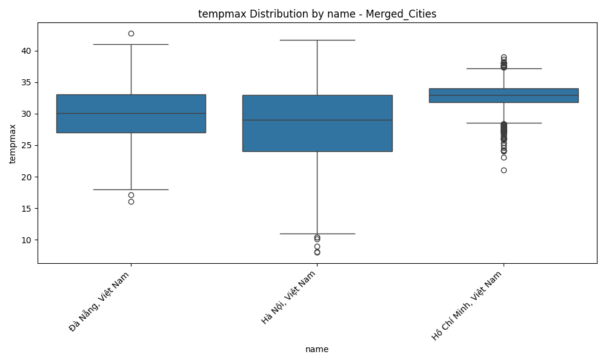
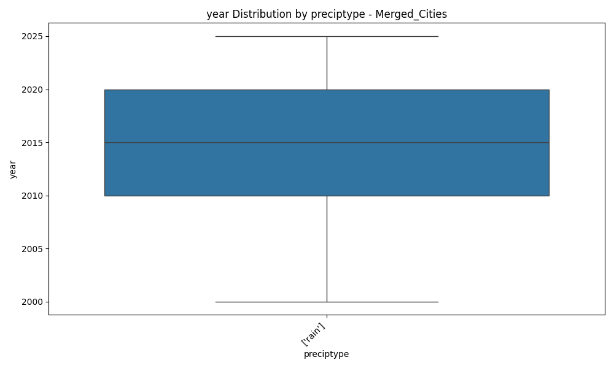
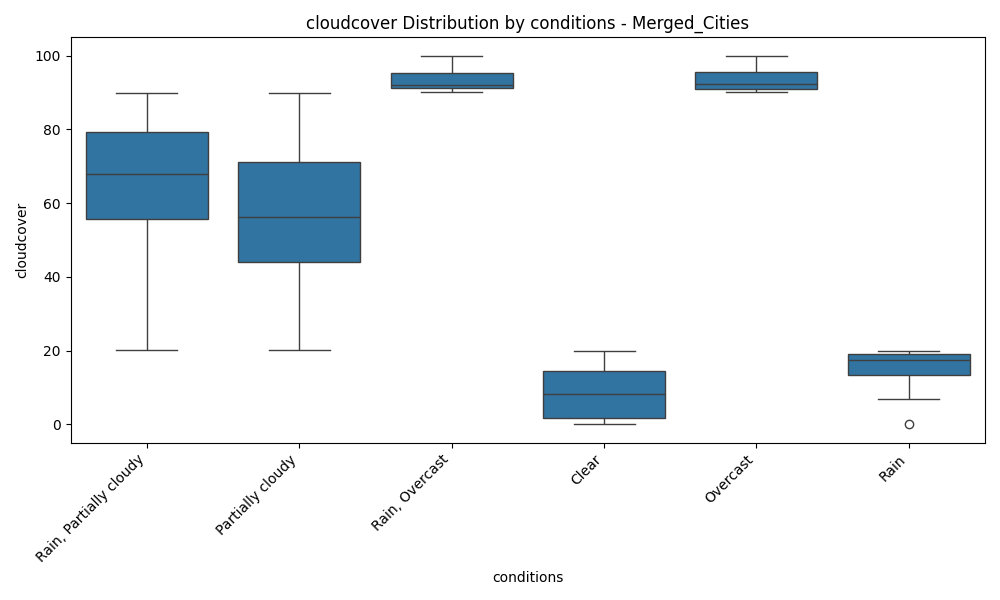
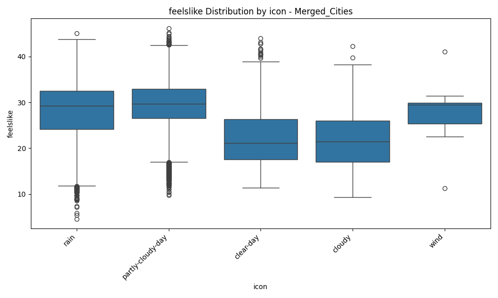
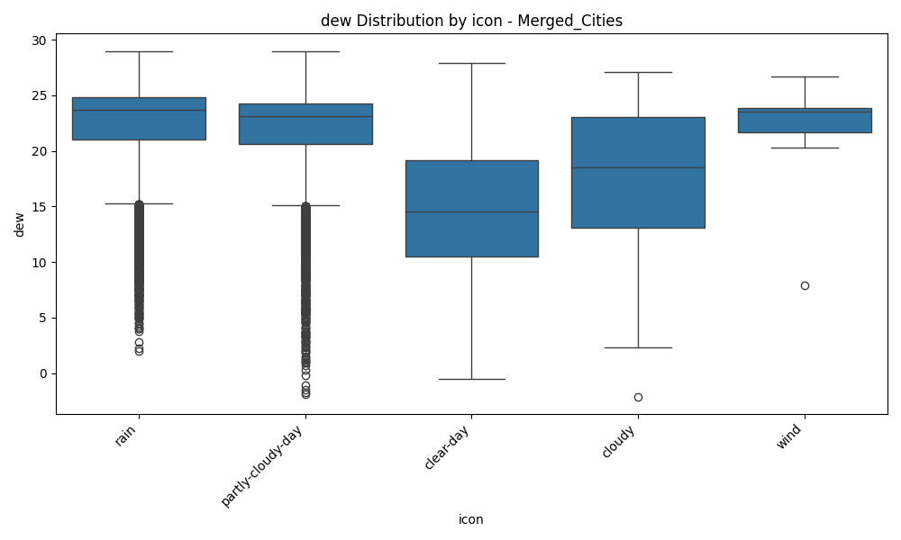
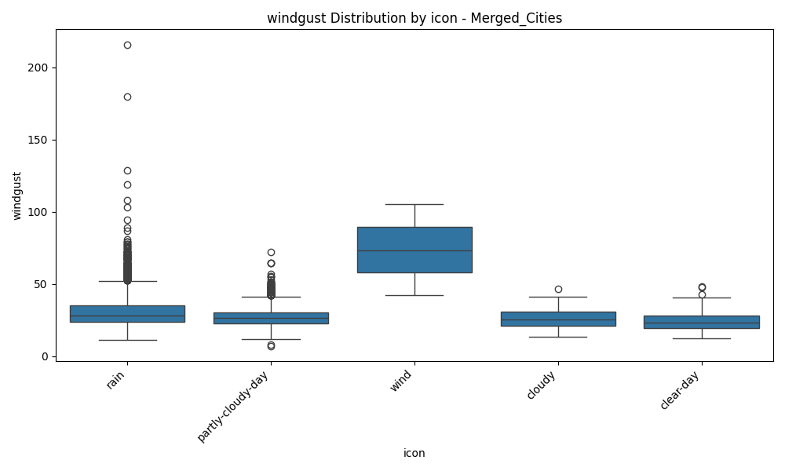

# EDA Report for Merged_Cities

## Executive Summary
This report provides an Exploratory Data Analysis (EDA) for the weather data of {city_name}. It includes dataset overview, missing value analysis, statistical summaries, correlation analysis, temporal analysis, categorical feature analysis, and data quality evaluation.

## Dataset Overview
This section provides a general overview of the dataset.

* **Number of records:** 27535
* **Time period:** 2000-01-01 00:00:00 to 2025-02-13 00:00:00
* **Number of features:** 38

## Missing Values
This section details the missing values present in the dataset.

* **precip**: 3662 missing values
* **preciptype**: 13557 missing values
* **snow**: 16344 missing values
* **snowdepth**: 16359 missing values
* **windgust**: 16035 missing values
* **sealevelpressure**: 27535 missing values
* **solarradiation**: 10959 missing values
* **solarenergy**: 10959 missing values
* **uvindex**: 10959 missing values
* **severerisk**: 26208 missing values

## Key Weather Statistics (Numerical)
This section presents descriptive statistics for the numerical weather metrics.

### tempmax
* **Average:** 30.27
* **Maximum:** 42.70
* **Minimum:** 8.00

### tempmin
* **Average:** 23.01
* **Maximum:** 31.00
* **Minimum:** 3.80

### temp
* **Average:** 26.19
* **Maximum:** 35.50
* **Minimum:** 7.00

### feelslikemax
* **Average:** 34.70
* **Maximum:** 56.70
* **Minimum:** 6.40

### feelslikemin
* **Average:** 23.42
* **Maximum:** 40.40
* **Minimum:** 0.40

### feelslike
* **Average:** 28.54
* **Maximum:** 46.20
* **Minimum:** 4.60

### dew
* **Average:** 21.90
* **Maximum:** 29.00
* **Minimum:** -2.10

### humidity
* **Average:** 78.92
* **Maximum:** 100.00
* **Minimum:** 31.10

### precip
* **Average:** 5.44
* **Maximum:** 632.67
* **Minimum:** 0.00

### precipprob
* **Average:** 50.48
* **Maximum:** 100.00
* **Minimum:** 0.00

### precipcover
* **Average:** 6.91
* **Maximum:** 100.00
* **Minimum:** 0.00

### snow
* **Average:** 0.00
* **Maximum:** 0.00
* **Minimum:** 0.00

### snowdepth
* **Average:** 0.00
* **Maximum:** 0.00
* **Minimum:** 0.00

### windgust
* **Average:** 29.54
* **Maximum:** 216.00
* **Minimum:** 7.20

### windspeed
* **Average:** 18.76
* **Maximum:** 156.20
* **Minimum:** 3.60

### winddir
* **Average:** 156.17
* **Maximum:** 360.00
* **Minimum:** 0.00

### sealevelpressure
* **Average:** nan
* **Maximum:** nan
* **Minimum:** nan

### cloudcover
* **Average:** 64.35
* **Maximum:** 100.00
* **Minimum:** 0.00

### visibility
* **Average:** 9.24
* **Maximum:** 76.80
* **Minimum:** 1.30

### solarradiation
* **Average:** 189.43
* **Maximum:** 333.50
* **Minimum:** 0.00

### solarenergy
* **Average:** 16.36
* **Maximum:** 28.90
* **Minimum:** 0.00

### uvindex
* **Average:** 6.85
* **Maximum:** 10.00
* **Minimum:** 0.00

### severerisk
* **Average:** 29.59
* **Maximum:** 75.00
* **Minimum:** 5.00

### moonphase
* **Average:** 0.48
* **Maximum:** 0.98
* **Minimum:** 0.00

### month
* **Average:** 6.50
* **Maximum:** 12.00
* **Minimum:** 1.00

### year
* **Average:** 2012.07
* **Maximum:** 2025.00
* **Minimum:** 2000.00

### day
* **Average:** 15.72
* **Maximum:** 31.00
* **Minimum:** 1.00

### dayofweek
* **Average:** 3.00
* **Maximum:** 6.00
* **Minimum:** 0.00

## Correlation Analysis
Correlation analysis helps to understand the linear relationships between numerical features. The heatmap below visualizes the correlation matrix.

## Numerical Analysis Plots
Distributions and box plots of key numerical metrics are shown below to understand data spread and potential outliers.

## Temporal Analysis
This section explores the temporal patterns in the weather data, including monthly and daily trends.

## Advanced Temporal Analysis
Advanced time series analysis, including rolling statistics, ACF/PACF plots, and seasonal decomposition, are presented here.

## Categorical Analysis
Analysis of categorical features, including value counts and distribution plots where applicable.

### name Analysis
Value Counts:
* **Đà Nẵng, Việt Nam**: 9179
* **Hà Nội, Việt Nam**: 9178
* **Hồ Chí Minh, Việt Nam**: 9178

### preciptype Analysis
Column 'preciptype' is constant with only 1 unique value. No further analysis is provided.

### conditions Analysis
Value Counts:
* **Partially cloudy**: 12325
* **Rain, Partially cloudy**: 11432
* **Rain, Overcast**: 2439
* **Overcast**: 670
* **Clear**: 640
* **Rain**: 29

### description Analysis
Value Counts (Top 20):
* **Partly cloudy throughout the day.**: 12051
* **Partly cloudy throughout the day with rain.**: 2882
* **Partly cloudy throughout the day with late afternoon rain.**: 2166
* **Partly cloudy throughout the day with a chance of rain throughout the day.**: 1986
* **Partly cloudy throughout the day with early morning rain.**: 1260
* **Partly cloudy throughout the day with afternoon rain.**: 1053
* **Partly cloudy throughout the day with rain in the morning and afternoon.**: 1030
* **Cloudy skies throughout the day with a chance of rain throughout the day.**: 707
* **Cloudy skies throughout the day with rain.**: 699
* **Cloudy skies throughout the day.**: 670
* **Partly cloudy throughout the day with morning rain.**: 650
* **Clear conditions throughout the day.**: 635
* **Partly cloudy throughout the day with rain clearing later.**: 304
* **Cloudy skies throughout the day with rain in the morning and afternoon.**: 266
* **Cloudy skies throughout the day with early morning rain.**: 202
* **Cloudy skies throughout the day with afternoon rain.**: 193
* **Cloudy skies throughout the day with late afternoon rain.**: 186
* **Becoming cloudy in the afternoon.**: 140
* **Clearing in the afternoon.**: 139
* **Cloudy skies throughout the day with morning rain.**: 130

### icon Analysis
Value Counts:
* **rain**: 13900
* **partly-cloudy-day**: 12316
* **cloudy**: 668
* **clear-day**: 640
* **wind**: 11

### stations Analysis
High cardinality column with 52 unique values. Detailed value counts not displayed.

### city Analysis
Value Counts:
* **DaNang**: 9179
* **Hanoi**: 9178
* **HoChiMinh**: 9178

## Numerical vs Categorical Analysis
Box plots showing the distribution of numerical features across different categories (for low cardinality categorical features).

### tempmax by name

### tempmin by name

### temp by name

### feelslikemax by name

### feelslikemin by name

### feelslike by name

### dew by name

### humidity by name

### precip by name

### precipprob by name

### precipcover by name

### snow by name

### snowdepth by name

### windgust by name

### windspeed by name

### winddir by name

### sealevelpressure by name

### cloudcover by name

### visibility by name

### solarradiation by name

### solarenergy by name

### uvindex by name

### severerisk by name

### moonphase by name

### month by name

### year by name

### day by name

### dayofweek by name

### tempmax by preciptype

### tempmin by preciptype

### temp by preciptype

### feelslikemax by preciptype

### feelslikemin by preciptype

### feelslike by preciptype

### dew by preciptype

### humidity by preciptype

### precip by preciptype

### precipprob by preciptype

### precipcover by preciptype

### snow by preciptype

### snowdepth by preciptype

### windgust by preciptype

### windspeed by preciptype

### winddir by preciptype

### sealevelpressure by preciptype

### cloudcover by preciptype

### visibility by preciptype

### solarradiation by preciptype

### solarenergy by preciptype

### uvindex by preciptype

### severerisk by preciptype

### moonphase by preciptype

### month by preciptype

### year by preciptype

### day by preciptype

### dayofweek by preciptype

### tempmax by conditions

### tempmin by conditions

### temp by conditions

### feelslikemax by conditions

### feelslikemin by conditions

### feelslike by conditions

### dew by conditions

### humidity by conditions

### precip by conditions

### precipprob by conditions

### precipcover by conditions

### snow by conditions

### snowdepth by conditions

### windgust by conditions

### windspeed by conditions

### winddir by conditions

### sealevelpressure by conditions

### cloudcover by conditions

### visibility by conditions

### solarradiation by conditions

### solarenergy by conditions

### uvindex by conditions

### severerisk by conditions

### moonphase by conditions

### month by conditions

### year by conditions

### day by conditions

### dayofweek by conditions

### tempmax by icon

### tempmin by icon

### temp by icon

### feelslikemax by icon

### feelslikemin by icon

### feelslike by icon

### dew by icon

### humidity by icon

### precip by icon

### precipprob by icon

### precipcover by icon

### snow by icon

### snowdepth by icon

### windgust by icon

### windspeed by icon

### winddir by icon

### sealevelpressure by icon

### cloudcover by icon

### visibility by icon

### solarradiation by icon

### solarenergy by icon

### uvindex by icon

### severerisk by icon

### moonphase by icon

### month by icon

### year by icon

### day by icon

### dayofweek by icon

### tempmax by city

### tempmin by city

### temp by city

### feelslikemax by city

### feelslikemin by city

### feelslike by city

### dew by city

### humidity by city

### precip by city

### precipprob by city

### precipcover by city

### snow by city

### snowdepth by city

### windgust by city

### windspeed by city

### winddir by city

### sealevelpressure by city

### cloudcover by city

### visibility by city

### solarradiation by city

### solarenergy by city

### uvindex by city

### severerisk by city

### moonphase by city

### month by city

### year by city

### day by city

### dayofweek by city

## Evaluation Summary
This section summarizes the data quality evaluation. Please refer to the detailed evaluation report for in-depth analysis of outliers, skewness/kurtosis, and stationarity.

Please refer to the detailed evaluation report: `Merged_Cities_evaluation.txt`.
This file includes information about outliers, skewness/kurtosis, and stationarity test results.

## Conclusion
Based on the EDA, key findings for {city_name} include: ... (Summary of key findings, e.g., important correlations, trends, data quality issues).